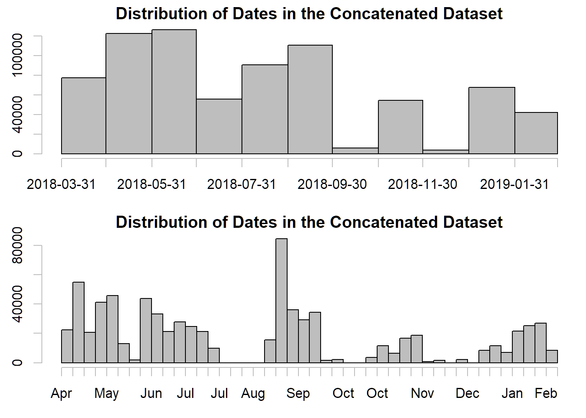
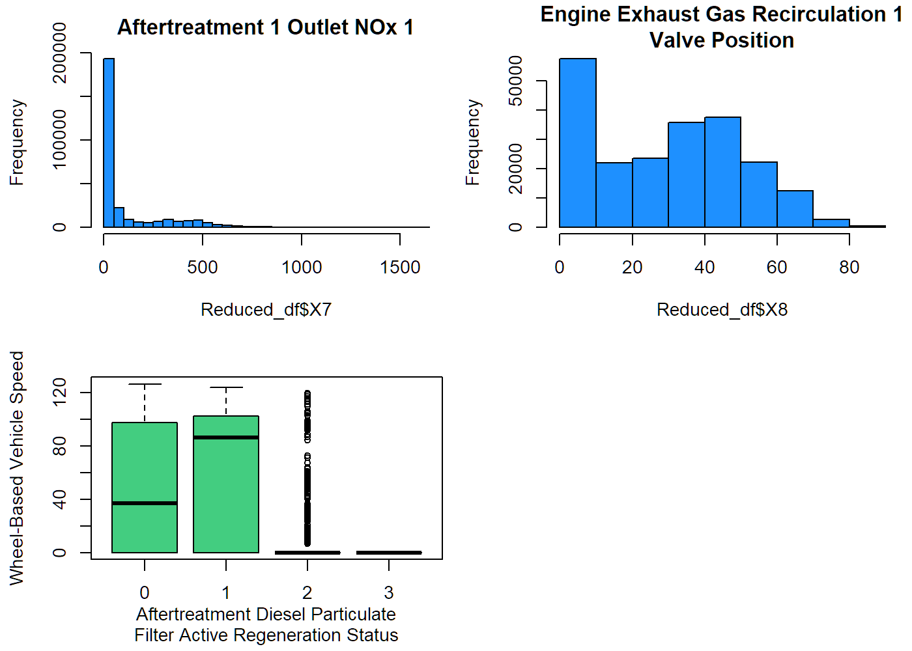
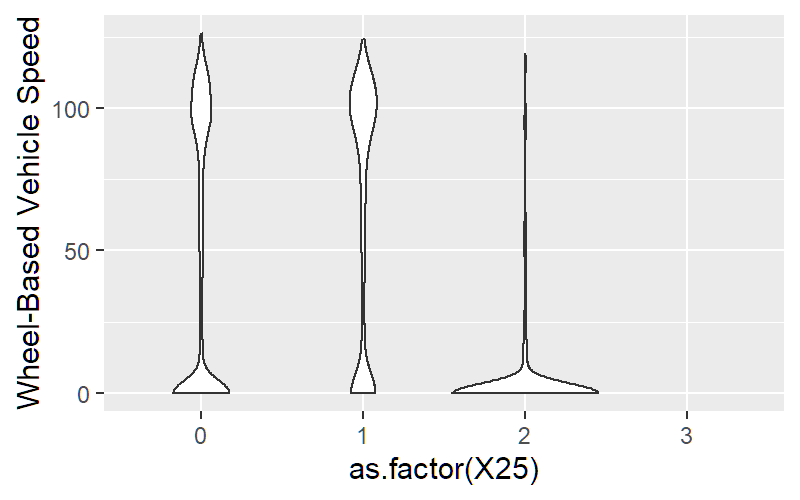
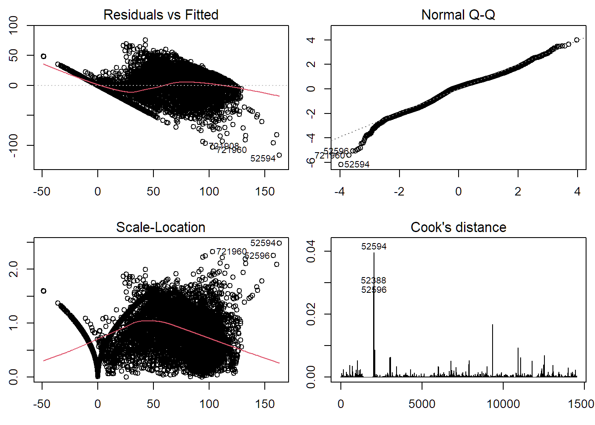

This is an R Markdown file which conducts an exploratory analysis on the
data from numerous sensors that were installed in/onto a commercial
vehicle, over the course of 100 operating blocks (e.g., car movement
speed, internal car fluid temperature, engine speed).

I was supplied with 100 .csv files (each representing an operating
block) and was tasked with proposing my own outcome (or research
question) to study in the data, followed by suggesting an appropriate
machine learning or statistical (regression) model based on the
parameterization of my outcome. The outcome variable/research question
was not a very high priority for this project; this assignment was given
to me to primarily assess my analytical and modeling abilities.

I first chose to build a function to quicken the import of .csv files
and later, decided to concatenate all 100 files into one (low MB size,
thus plausible), due to a large percentage of missing data (80-90%
missing) in each of the individual .csv files. I cleaned and reduced
this concatenated dataset a bit further before conducting any analyses
on it.

**Loading Files/ Importing Data**

Here, I am loading in a JSON data dictionary that I had been given for
this project, in order to figure out what each of the columns stand for,
in each .csv file. Let’s confirm that there are 100 .csv files to work
with in the directory where I stored the files.

    js<-fromJSON(txt="./DataScienceTestFiles/column_dict.json", flatten = TRUE)

    files_csv<-list.files(path = "./DataScienceTestFiles", pattern = c("^O","\\.csv$"))
    length(grep("^O", files_csv))

    ## [1] 100

I’m now creating a function to read any .csv file of my choosing, by
specifying a number. Upon previewing the data, I noticed that we were
dealing with a UNIX format for the time column of the dataset (`X`). I
converted this column into a ‘YYYY-MM-DD’ format and previewed the
converted sample .csv file.

    load_data<-function(num){
      x<-read.csv(paste("./DataScienceTestFiles/",files_csv[num+1],sep = ""), header = TRUE)
    }
    df<-load_data(0)

    newX<-as.POSIXct(df$X, origin="1970-01-01")
    df$X<-newX
    head(df)

    ##                     X X1      X2    X3   X4 X5 X6 X7   X8 X9 X10 X11 X12 X13
    ## 1 2018-05-21 08:29:41 NA      NA    NA   NA NA NA NA   NA NA  NA  NA  NA  NA
    ## 2 2018-05-21 08:29:42 NA      NA    NA   NA NA NA NA 6.15 NA  NA  NA  NA  NA
    ## 3 2018-05-21 08:29:43  0 694.125 292.3 72.7 NA NA  0   NA NA  NA  NA  NA  NA
    ## 4 2018-05-21 08:29:45  0 694.875    NA   NA NA NA NA   NA NA  NA  NA  NA  NA
    ## 5 2018-05-21 08:29:46 NA      NA    NA   NA NA NA NA   NA NA  NA  NA  NA  NA
    ## 6 2018-05-21 08:29:47 NA      NA    NA   NA NA NA  0 6.15 NA  NA  NA  NA  NA
    ##   X14 X15 X16 X17 X18 X19 X20 X21 X22 X23 X24 X25 X26 X27
    ## 1  NA  NA  NA  NA  NA  NA  NA  NA  NA  NA  NA   0  NA  NA
    ## 2  NA  NA  NA  NA  NA  NA  NA  NA  NA  NA  NA   0  NA  NA
    ## 3  NA  NA  NA  NA  NA  NA  NA  NA  NA  NA  NA   0  NA  NA
    ## 4   0 504  NA  NA  NA  NA  NA  NA  NA  NA  NA   0  NA  NA
    ## 5  NA  NA  NA  NA  NA  NA  NA  NA  NA  NA  NA   0  NA  NA
    ## 6  NA  NA  NA  NA  NA  NA  NA  NA  NA  NA  NA   0  NA  NA

Now I am getting a closer look at the data.

    print(diagnose(df))

    ## # A tibble: 28 x 6
    ##    variables types   missing_count missing_percent unique_count unique_rate
    ##    <chr>     <chr>           <int>           <dbl>        <int>       <dbl>
    ##  1 X         POSIXct             0             0          10196    1       
    ##  2 X1        numeric          6673            65.4          102    0.0100  
    ##  3 X2        numeric          6673            65.4         1339    0.131   
    ##  4 X3        numeric          8106            79.5         1229    0.121   
    ##  5 X4        numeric          8106            79.5         1072    0.105   
    ##  6 X5        numeric          9184            90.1          146    0.0143  
    ##  7 X6        numeric          9184            90.1           80    0.00785 
    ##  8 X7        numeric          8216            80.6          136    0.0133  
    ##  9 X8        numeric          9274            91.0          200    0.0196  
    ## 10 X9        numeric         10088            98.9            4    0.000392
    ## # ... with 18 more rows

    print(object.size(df), standard="auto", units="Mb")

    ## 2.1 Mb

I noticed that my one sample contained a lot of missing data. The file
size of the .csv was also fairly small. I looked at a few more .csv
using my above loading function and noticed that many of the other .csv
files in the folder were also like this.

I decided to do a loop to concatenate all the .csv files together, and
improve the sample size of my overall data.

    Main_df<-load_data(0)
    for (i in files_csv[2:length(files_csv)]){
      x<-read.csv(paste("./DataScienceTestFiles/",i,sep = ""), header = TRUE)
      Main_df<-rbind(Main_df,x)
    }
    print(object.size(Main_df), standard="auto", units="Mb")

    ## 155.6 Mb

    newX<-as.POSIXct(Main_df$X, origin="1970-01-01")
    Main_df$X<-newX

What is the time/date range of the concatenated dataset?

    par(mfrow=c(2,1),mai = c(0.6, 0.5, 0.3, 0.1))

    hist(Main_df$X, breaks="months", freq = TRUE, col="grey",
         main = "Distribution of Dates in the Concatenated Dataset")
    hist(Main_df$X, breaks="weeks", freq = TRUE, col="grey",
         main = "Distribution of Dates in the Concatenated Dataset")

    range(Main_df$X)

    ## [1] "2018-04-19 08:36:03 EDT" "2019-02-13 07:17:36 EST"

**Begin Actual Analysis of Data**

How much missing data is there after combining all 100 .csv operating
blocks into one?

    diag_df<-diagnose(Main_df)
    diag_df

    ## # A tibble: 28 x 6
    ##    variables types   missing_count missing_percent unique_count unique_rate
    ##    <chr>     <chr>           <int>           <dbl>        <int>       <dbl>
    ##  1 X         POSIXct             0             0         755550   1        
    ##  2 X1        numeric        467540            61.9          102   0.000135 
    ##  3 X2        numeric        467540            61.9         5042   0.00667  
    ##  4 X3        numeric        461742            61.1         5479   0.00725  
    ##  5 X4        numeric        461742            61.1         2880   0.00381  
    ##  6 X5        numeric        538881            71.3          227   0.000300 
    ##  7 X6        numeric        538881            71.3          122   0.000161 
    ##  8 X7        numeric        465689            61.6         1390   0.00184  
    ##  9 X8        numeric        541641            71.7          766   0.00101  
    ## 10 X9        numeric        735120            97.3           53   0.0000701
    ## # ... with 18 more rows

There’s still a lot of missing data. Let’s choose to remove variables
with &gt;90% missing data, as suggested by the results of the simulation
study by Madley-Dowd et al (2019). Multiple imputation (MI) still
performed well when 90% or less of the data was missing.

    low_missing<-diag_df$variables[diag_df$missing_percent<=90]

    Reduced_df<-Main_df[low_missing]
    diagnose(Reduced_df)

    ## # A tibble: 15 x 6
    ##    variables types   missing_count missing_percent unique_count unique_rate
    ##    <chr>     <chr>           <int>           <dbl>        <int>       <dbl>
    ##  1 X         POSIXct             0             0         755550  1         
    ##  2 X1        numeric        467540            61.9          102  0.000135  
    ##  3 X2        numeric        467540            61.9         5042  0.00667   
    ##  4 X3        numeric        461742            61.1         5479  0.00725   
    ##  5 X4        numeric        461742            61.1         2880  0.00381   
    ##  6 X5        numeric        538881            71.3          227  0.000300  
    ##  7 X6        numeric        538881            71.3          122  0.000161  
    ##  8 X7        numeric        465689            61.6         1390  0.00184   
    ##  9 X8        numeric        541641            71.7          766  0.00101   
    ## 10 X16       numeric        666191            88.2         8872  0.0117    
    ## 11 X17       numeric        533714            70.6        11832  0.0157    
    ## 12 X18       numeric        533714            70.6          150  0.000199  
    ## 13 X20       numeric        536098            71.0        10353  0.0137    
    ## 14 X21       numeric        536098            71.0        11827  0.0157    
    ## 15 X25       numeric             0             0              4  0.00000529

Much better.

The data seems to be all continuous except for potentially `X25`. Let’s
check to make sure:

    hist(Reduced_df$X25, col='orange', main = 
           paste(strwrap(js$`25`$Description, width = 35), collapse = "\n")
         )

We should technically conduct univariate statistics across all of the
other variables here before proceeding further, however I am also
interested in just exploring some of the potential relationships among
the variables for now.

My dataset is currently too large in size to make a scatterplot matrix
across all variables. Let’s make a correlation matrix for now, for some
quick visualizations.

Note that we must use “pairwise complete observations” or other similar
methods of correlation–even if they are not ideal–in order for the
corrplot package to work. Because of the high amount of missing data
(which might leave my entire correlation plot very empty), I decided to
use pairwise for now just to visualize the data. Note that I did go back
to try a “complete case only” method and had a similar corrplot.

    cor.df<-cor(Reduced_df[2:15], use="pairwise.complete.obs")
    sig.df<-cor.mtest(Reduced_df[2:15])

    # Make a corrplot--originally had it show p-values but font too small to see.
    corrplot(cor.df, method="color")

&lt;img
src=“Stat-Vehicle-Analysis—Operating-Block-RMD\_files/figure-markdown\_strict/corrplot-1.png”
trim={0, 1cm 0 0.5cm },clip style=“display: block; margin: auto;” /&gt;

There’s relatively high correlations among the variables.

At this point, we need to start examining some sort of objective or test
what sort of model we might like to use. Vehicle speed (variable X16)
seems like it might be an interesting outcome to work with. X16 is
linearly associated with everything BUT X7, X8, X25. Let’s look at these
variables more closely, using both our JSON dictionary and some plots. I
will also be making a violin plot of the categorical variable.

    cat(js$`7`$Description, ", ", js$`7`$Unit, "\n",
        js$`8`$Description, ", ", js$`8`$Unit, "\n",
        js$`25`$Description,", ", js$`25`$Unit) 

    ## Aftertreatment 1 Outlet NOx 1 ,  ppm 
    ##  Engine Exhaust Gas Recirculation 1 Valve Position ,  % 
    ##  Aftertreatment Diesel Particulate Filter Active Regeneration Status ,  bit

    par(mfrow=c(2,2), mai = c(0.7, 0.7, 0.4, 0.1))
    hist(Reduced_df$X7, breaks = 40, col="dodgerblue1", main = 
           paste(strwrap(js$`7`$Description, width = 35), collapse = "\n")
           )
    hist(Reduced_df$X8, breaks=10, col="dodgerblue1", main = 
           paste(strwrap(js$`8`$Description, width = 35), collapse = "\n")
           )
    boxplot(Reduced_df$X16~Reduced_df$X25, col='seagreen3', 
            xlab=paste(strwrap(js$`25`$Description, width = 40), collapse = "\n"), 
            ylab=js$`16`$Description) # y var ~ x var. 

    ggplot(Reduced_df, aes(y=X16, x=as.factor(X25))) + 
      geom_violin() +
      labs(y=js$`16`$Description)

    ## Warning: Removed 666191 rows containing non-finite values (stat_ydensity).

Removing the date variable first to make it easier to generate a model.

    Reduced_df<-Reduced_df[2:ncol(Reduced_df)]

Making another scatterplot matrix, this time on a reduced sample of the
data with vehicle speed as an outcome to see what type of model might be
appropriate to use if vehicle speed was set as our outcome.

    set.seed(3)
    smaller<-Reduced_df[sample(nrow(Reduced_df),nrow(Reduced_df)*.1),  ]

    par(mfrow=c(3,2), mai = c(0.3, 0.6, 0.1, 0.1))
    plot(smaller$X16~., data=smaller, ylab = "Vehicle speed (km/h)")

&lt;img
src=“Stat-Vehicle-Analysis—Operating-Block-RMD\_files/figure-markdown\_strict/reduced\_scatterplot\_vehiclespd-1.png”
trim={0 0 0 0.2cm},clip /&gt;&lt;img
src=“Stat-Vehicle-Analysis—Operating-Block-RMD\_files/figure-markdown\_strict/reduced\_scatterplot\_vehiclespd-2.png”
trim={0 0 0 0.2cm},clip /&gt;&lt;img
src=“Stat-Vehicle-Analysis—Operating-Block-RMD\_files/figure-markdown\_strict/reduced\_scatterplot\_vehiclespd-3.png”
trim={0 0 0 0.2cm},clip /&gt;

Multiple linear regression might not be the best, but let’s try try it
for now and see what happens (or what the diagnostic plot post-modeling
might suggest. This is just a test model).

    Reduced_df.lm<-lm(Reduced_df$X16~., Reduced_df)
    summary(Reduced_df.lm) 

    ## 
    ## Call:
    ## lm(formula = Reduced_df$X16 ~ ., data = Reduced_df)
    ## 
    ## Residuals:
    ##     Min      1Q  Median      3Q     Max 
    ## -116.73  -12.48    3.17   12.72   76.03 
    ## 
    ## Coefficients:
    ##               Estimate Std. Error t value Pr(>|t|)    
    ## (Intercept) -5.053e+01  8.320e-01 -60.735  < 2e-16 ***
    ## X1           2.584e-01  1.353e-02  19.103  < 2e-16 ***
    ## X2           7.850e-03  1.157e-03   6.782 1.23e-11 ***
    ## X3           3.718e-02  2.727e-03  13.635  < 2e-16 ***
    ## X4          -4.977e-02  2.574e-03 -19.340  < 2e-16 ***
    ## X5          -1.196e+01  3.043e+00  -3.929 8.56e-05 ***
    ## X6           6.375e+00  3.078e+00   2.071   0.0383 *  
    ## X7          -8.724e-04  8.663e-04  -1.007   0.3139    
    ## X8           8.620e-02  8.902e-03   9.683  < 2e-16 ***
    ## X17          2.329e+00  9.177e+00   0.254   0.7997    
    ## X18          1.957e+01  3.072e+00   6.370 1.94e-10 ***
    ## X20          3.345e-01  9.050e-03  36.962  < 2e-16 ***
    ## X21         -2.377e+00  9.177e+00  -0.259   0.7956    
    ## X25         -2.155e+00  4.162e-01  -5.177 2.28e-07 ***
    ## ---
    ## Signif. codes:  0 '***' 0.001 '**' 0.01 '*' 0.05 '.' 0.1 ' ' 1
    ## 
    ## Residual standard error: 19.05 on 14525 degrees of freedom
    ##   (741011 observations deleted due to missingness)
    ## Multiple R-squared:  0.829,  Adjusted R-squared:  0.8289 
    ## F-statistic:  5417 on 13 and 14525 DF,  p-value: < 2.2e-16

Output here has a lot of exponents in many of the numbers. Let’s look at
the distribution of our outcome variable to see if there might be
anything unusual (should have done this at the beginning).

    par(mfrow=c(1,2))

    hist(Reduced_df$X16, breaks = 40, col="dodgerblue1", main = 
           "Vehicle speed (km/h)", xlab="") 
    hist(Reduced_df$X16[Reduced_df$X16<20], breaks=10, col="dodgerblue1", main = 
           "Vehicle speed < 20 (km/h)", xlab="")

&lt;img
src=“Stat-Vehicle-Analysis—Operating-Block-RMD\_files/figure-markdown\_strict/browse\_outcome-1.png”
trim={0 1cm 0 0},clip /&gt;

We have an extremely high frequency of 0 km/h. but this is also a pretty
“natural”/normal speed for a vehicle and thus the high frequently of
this value is not necessarily an error/outlier–reasonable that a vehicle
would be at 0 km/h often.

Perhaps we might need to try some sort of dichotomous model? But let’s
look at the model diagnostics first to get more information.

    par(mfrow=c(2,2), mai = c(0.5, 0.4, 0.3, 0.1))
    plot(Reduced_df.lm, which=1:4)

The residuals vs fitted and Normal Q-Q plots look okay. Scale-location
suggests that multiple linear regression might not be best, or that we
might want to try transforming our outcome variable. Cook’s distance
suggests some outliers to look into.

**Next steps?**

-   Possibly try transforming the outcome variable, dichotomizing it
    (risky), some sort of polynomial model, or a support vector machine
    model.

-   Check for multicollinearity if using a traditional statistical
    model.

-   Use stepwise variable selection to remove/add variables.

-   Conduct likelihood ratio (LR) test between every removal/addition of
    a variable if using a traditional statistical model (nested)
